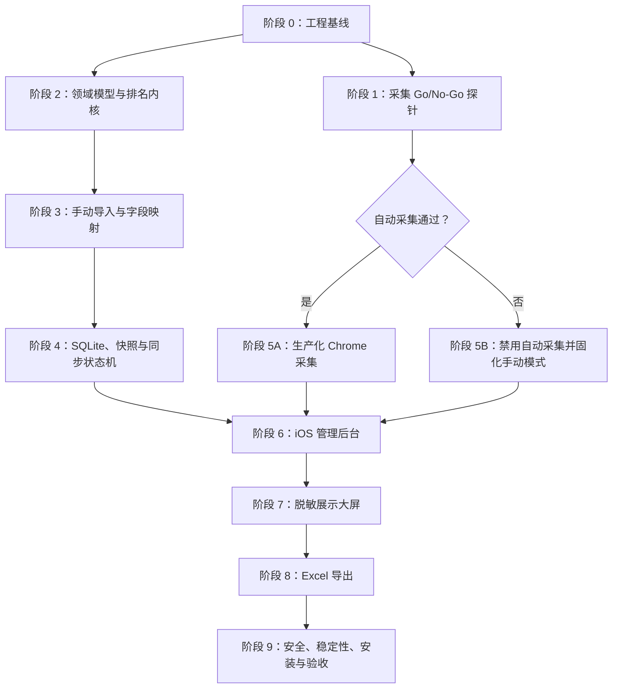

# 信息素养大赛成绩核对系统实施计划

> 状态：待执行
>
> 日期：2026-07-19
>
> 依据：`开发文档.md`、`AGENTS.md`
>
> 目标分支：`main`

## 1. 实施策略

本计划采用“风险优先、可用能力逐层增加”的顺序：

1. 先搭建最小工程与安全边界。
2. 立即验证金山文档只读自动采集是否真正可行。
3. 独立完成字段模型、成绩校验和排名内核。
4. 先交付不依赖自动采集的手动导入闭环。
5. 再完成快照、同步、管理后台、大屏和导出。
6. 自动采集只有通过真实 Go/No-Go 门后才接入正式发布链路。
7. 最后完成安装、4 小时稳定性测试和现场演练。

自动采集失败不会推翻整个项目。系统必须保留手动复制或文件导入，并如实显示“自动采集验证未通过”。

## 2. 交付形态

### 2.1 自动采集通过时

- Chrome 扩展识别已登录的目标金山文档。
- 每 60 秒自动同步，也支持“立即同步”。
- 完整候选数据通过校验后原子发布。
- 手动导入作为故障兜底。

### 2.2 自动采集未通过时

- 不发布生产版自动采集入口。
- 管理后台明确显示“自动采集不可用”。
- 通过复制粘贴、CSV 或 XLSX 导入完成排名闭环。
- 排名、大屏、快照和导出功能保持不变。

## 3. 阶段依赖



阶段 1 和阶段 2 可以交错推进，但不得因为模拟排名通过就跳过真实采集验证。

## 4. 阶段 0：工程基线

### 任务 0.1：创建 pnpm workspace

**新增文件**

- `package.json`
- `pnpm-workspace.yaml`
- `tsconfig.base.json`
- `eslint.config.js`
- `vitest.workspace.ts`
- `.editorconfig`
- `README.md`
- `.env.example`

**新增目录**

- `apps/extension/`
- `apps/server/`
- `apps/web/`
- `packages/domain/`
- `packages/ranking/`
- `packages/storage/`
- `packages/ui/`
- `tests/fixtures/`
- `tests/e2e/`

**执行步骤**

1. 根包标记为私有 workspace。
2. 固定 Node 与 pnpm 运行要求，但不提交本机绝对路径。
3. 建立根命令：`dev`、`lint`、`test`、`test:e2e`、`build`、`typecheck`。
4. 所有 TypeScript 包继承严格配置。
5. 更新 `.gitignore`，覆盖 `data/`、`exports/`、SQLite、抓包、扩展构建物和本地密钥。
6. README 只写真实可运行命令；未实现的入口明确标为尚未提供，不伪造运行结果。

**验证**

```bash
pnpm install
pnpm typecheck
pnpm lint
pnpm test
pnpm build
```

首个基线允许测试数量为零，但所有命令必须有明确退出状态，不能使用永远成功的占位脚本。

**完成标准**

- workspace 安装成功。
- 每个应用和包拥有独立 `package.json`。
- 根命令能发现所有 workspace。
- `git status` 不出现运行时数据或秘密文件。

**建议提交**

```text
chore: scaffold local competition workspace
```

### 任务 0.2：建立合成测试数据

**新增文件**

- `tests/fixtures/records.valid.json`
- `tests/fixtures/records.invalid.json`
- `tests/fixtures/records.large.json` 或等价生成器
- `tests/fixtures/README.md`

**执行步骤**

1. 使用完全虚构的赛区、赛项、组别、姓名和成绩。
2. 覆盖整数、一位小数、两位小数、同分、空值、文本、越界和三位小数。
3. 提供 5,000 条合成数据生成器，不提交真实金山记录。
4. Fixtures README 说明数据均为合成数据，禁止替换为真实敏感记录。

**验证**

- 扫描测试夹具，不出现真实手机号或身份证号格式。
- Schema 校验能够加载全部夹具。

**建议提交**

```text
test: add synthetic competition fixtures
```

## 5. 阶段 1：金山文档采集 Go/No-Go 探针

这是整个项目的首要风险门。探针只验证结构、计数、稳定标识和变化检测，不把真实敏感值写入日志或 Git。

### 任务 1.1：最小本机探针接收端

**新增文件**

- `apps/server/src/probe/server.ts`
- `apps/server/src/probe/schema.ts`
- `apps/server/src/probe/redact.ts`
- `apps/server/test/probe.test.ts`

**执行步骤**

1. 只监听 `127.0.0.1`。
2. 生成一次性随机配对令牌。
3. 接收扩展上报的文档标识、字段名、记录数、记录 ID 哈希和内容哈希。
4. 日志只显示计数、字段名、哈希和错误码。
5. 拒绝来源不符、结构不符、体积超限和配对令牌错误的请求。

**验证**

```bash
pnpm --filter @xinxisuyang/server test -- probe
pnpm --filter @xinxisuyang/server typecheck
```

### 任务 1.2：最小 Manifest V3 扩展

**新增文件**

- `apps/extension/manifest.json`
- `apps/extension/src/background.ts`
- `apps/extension/src/content.ts`
- `apps/extension/src/page-bridge.ts`
- `apps/extension/src/messages.ts`
- `apps/extension/src/popup/`
- `apps/extension/test/messages.test.ts`

**执行步骤**

1. Host permission 仅覆盖目标金山域名和本机服务。
2. Content script 只在目标分享链接及其解析后的文档页面启用。
3. 页面上下文桥接按以下顺序尝试：
   - 页面运行时结构化数据模型或正式交互对象。
   - 当前登录页面自身产生的结构化请求结果。
   - 页面自带完整复制能力。
4. 只在已登录的目标页面内读取结果，不导出 Cookie，也不在浏览器外重放页面私有请求。
5. 不读取密码、验证码或其他标签页。
6. 弹窗只显示：目标页是否存在、连接状态、字段数、记录数、最后探针时间。
7. 任何失败都返回稳定错误码，不把原始响应体输出到日志。

**验证**

```bash
pnpm --filter @xinxisuyang/extension test
pnpm --filter @xinxisuyang/extension build
```

### 任务 1.3：真实 Chrome 验证

**人工前提**

- 用户本人在当前 Mac 的 Chrome 中登录金山文档。
- 用户打开目标链接并保持页面存在。
- 不使用用户密码、Cookie 导出或浏览器配置复制。

**验证步骤**

1. 从 `chrome://extensions` 以开发者模式加载构建后的扩展。
2. 打开目标文档，确认扩展只报告字段与记录元信息。
3. 连续重新加载 3 次，比较字段集合、记录数、记录 ID 哈希和内容哈希。
4. 改变水平和垂直滚动位置，再次采集，确认结果不变。
5. 将扩展暂时禁用后确认不再产生新的定时采集；另用错误配对令牌确认本机服务拒绝伪造连接。
6. 变化检测只能在用户明确安排的非正式测试记录上执行；若没有可安全修改的记录，该项保持“未验证”，自动采集不得进入生产状态。
7. 检查 Chrome、扩展、本机服务和 Git 工作区，不得落地真实敏感值。

**新增文件**

- `docs/采集验证报告.md`

验证报告必须给出以下唯一结论之一：

- `GO`：自动采集通过全部标准，可以进入阶段 5A。
- `NO-GO`：自动采集不稳定或不完整，进入阶段 5B。
- `未完成`：缺少变化检测等必要证据，自动采集继续保持关闭。

**Go 标准**

- 连续 3 次字段和记录数一致。
- 记录数与页面显示总数一致。
- 滚动位置不影响采集完整性。
- 必需字段均可识别。
- 稳定标识或等价去重机制可用。
- 一个同步周期内能发现经授权测试记录的变化。
- 采集过程确认只读。
- 敏感值未进入日志、报告和 Git。

**建议提交**

```text
spike: validate read-only kdocs collection path
```

## 6. 阶段 2：领域模型与排名内核

### 任务 2.1：规范字段与错误码

**新增文件**

- `packages/domain/src/record.ts`
- `packages/domain/src/event-rule.ts`
- `packages/domain/src/snapshot.ts`
- `packages/domain/src/sync-state.ts`
- `packages/domain/src/errors.ts`
- `packages/domain/src/display-dto.ts`
- `packages/domain/src/index.ts`
- `packages/domain/test/*.test.ts`

**执行步骤**

1. 用 Zod 定义所有外部输入和公共 DTO。
2. 建立字段映射模型，不允许静默相似字段匹配。
3. 定义异常码：空值、非数字、越界、精度超限、赛项未配置、字段缺失、记录不完整。
4. 分离管理 DTO 与展示大屏脱敏 DTO。
5. 建立姓名脱敏纯函数并覆盖不同长度。

**验证**

```bash
pnpm --filter @xinxisuyang/domain test
pnpm --filter @xinxisuyang/domain typecheck
```

### 任务 2.2：精确成绩解析与排名

**新增文件**

- `packages/ranking/src/parse-score.ts`
- `packages/ranking/src/validate-score.ts`
- `packages/ranking/src/partition.ts`
- `packages/ranking/src/rank.ts`
- `packages/ranking/src/index.ts`
- `packages/ranking/test/*.test.ts`

**执行步骤**

1. 使用十进制精确类型解析成绩。
2. 每个赛项必须存在最低分和最高分，无默认 `0–100`。
3. 拒绝空值、非数字、越界和超过两位小数。
4. 分区键固定为“赛区＋赛项＋组别”。
5. 标准竞赛排名实现为 `1、2、2、4`。
6. 同分保持来源顺序稳定，但名次完全相同。
7. 输出有效排名和异常列表，不修改输入记录。

**必须覆盖的测试**

- `96.8` 与 `96.80` 同分。
- `95.25、95.25、93.10` 得到 `1、1、3`。
- 跨赛区、赛项或组别不混排。
- `100.001` 被判定精度超限。
- 未配置赛项规则时全组不排名。
- 5,000 条合成记录结果稳定且无浮点误差。

**验证**

```bash
pnpm --filter @xinxisuyang/ranking test
pnpm --filter @xinxisuyang/ranking typecheck
```

**建议提交**

```text
feat: add exact competition ranking engine
```

## 7. 阶段 3：手动导入与字段映射闭环

这一阶段不等待自动采集结论，先保证系统有可用的数据入口。

### 任务 3.1：导入解析器

**新增文件**

- `apps/server/src/import/clipboard.ts`
- `apps/server/src/import/csv.ts`
- `apps/server/src/import/xlsx.ts`
- `apps/server/src/import/normalize.ts`
- `apps/server/src/import/routes.ts`
- `apps/server/test/import/*.test.ts`

**执行步骤**

1. 支持表格复制文本、CSV 和 XLSX。
2. 上传文件限制类型、大小和工作表数量。
3. 解析结果先进入候选区，不直接成为已发布数据。
4. 只返回字段名、记录数、映射预览和脱敏样例。
5. 文件解析失败不留下临时明文文件。

### 任务 3.2：字段映射与导入预览

**新增文件**

- `apps/server/src/mapping/service.ts`
- `apps/server/src/mapping/routes.ts`
- `apps/web/src/features/import/ImportWizard.tsx`
- `apps/web/src/features/import/FieldMapping.tsx`
- `apps/web/src/features/import/ImportPreview.tsx`

**执行步骤**

1. 管理员手动确认赛区、赛项、组别、姓名和成绩字段。
2. 手机号和身份证号为可选敏感字段，默认不映射。
3. 必需字段缺失时禁止继续。
4. 导入预览显示有效数、异常数、待配置赛项和分区数量。
5. 确认导入后才进入快照流程。

**验证**

```bash
pnpm --filter @xinxisuyang/server test -- import
pnpm --filter @xinxisuyang/web test -- import
```

**完成标准**

- 只使用合成数据即可完成导入、映射、校验、排名预览。
- 同一份数据通过三种入口得到相同规范记录和排名。

**建议提交**

```text
feat: add manual score import and field mapping
```

## 8. 阶段 4：SQLite、快照与同步状态机

### 任务 4.1：数据库 Schema 与迁移

**新增文件**

- `packages/storage/src/db.ts`
- `packages/storage/src/migrations/`
- `packages/storage/src/repositories/`
- `packages/storage/src/crypto/keychain.ts`
- `packages/storage/src/crypto/columns.ts`
- `packages/storage/test/*.test.ts`

**执行步骤**

1. 建立 `source_records`、`event_rules`、`sync_runs`、`snapshots`、`ranking_rows` 和 `audit_events`。
2. 手机号和身份证号按列加密。
3. 密钥写入 macOS Keychain，不写 `.env` 或仓库。
4. SQLite 数据库位于被 Git 忽略的 `data/`。
5. 迁移可重复执行，失败时不破坏现有数据库。

### 任务 4.2：内容哈希与原子快照

**新增文件**

- `packages/storage/src/snapshots/hash.ts`
- `packages/storage/src/snapshots/publish.ts`
- `packages/storage/src/snapshots/restore.ts`
- `packages/storage/test/snapshots.test.ts`

**执行步骤**

1. 规范化记录排序后计算内容哈希。
2. 哈希不变时只记录同步成功，不创建重复快照。
3. 候选记录、排名和当前快照切换处于同一事务。
4. 事务失败后仍指向上一成功快照。
5. 恢复旧快照时生成新的审计事件，不修改历史快照。

### 任务 4.3：同步状态机与本地 API

**新增文件**

- `apps/server/src/sync/state-machine.ts`
- `apps/server/src/sync/queue.ts`
- `apps/server/src/sync/service.ts`
- `apps/server/src/routes/sync.ts`
- `apps/server/src/routes/snapshots.ts`
- `apps/server/src/routes/rankings.ts`
- `apps/server/src/routes/display.ts`
- `apps/server/test/sync/*.test.ts`

**执行步骤**

1. 自动同步和立即同步共用单队列。
2. 同一时刻最多一个同步任务。
3. 状态覆盖：已连接、同步中、已同步、需要登录、页面关闭、字段变化、同步失败。
4. 120 秒无成功同步进入橙色过期状态，5 分钟进入红色严重警告。
5. 展示大屏接口只读取最近成功快照并返回脱敏 DTO。

**验证**

```bash
pnpm --filter @xinxisuyang/storage test
pnpm --filter @xinxisuyang/server test -- sync
```

**建议提交**

```text
feat: add atomic snapshots and sync state machine
```

## 9. 阶段 5：自动采集分支

### 任务 5A：生产化 Chrome 自动采集

仅在 `docs/采集验证报告.md` 结论为 `GO` 时执行。

**修改文件**

- `apps/extension/src/background.ts`
- `apps/extension/src/content.ts`
- `apps/extension/src/page-bridge.ts`
- `apps/extension/src/popup/`
- `apps/server/src/collect/extension.ts`
- `apps/server/src/sync/service.ts`

**执行步骤**

1. 把探针适配器收敛成独立、可测试的金山采集模块。
2. 扩展仅在管理员主动配对后向本机服务发送数据。
3. 自动同步默认 60 秒，支持立即同步消息。
4. 每次采集必须包含完整记录总数和字段版本。
5. 采集不完整、字段变化或登录失效时返回稳定错误码。
6. 原始响应体不进入日志、错误报告或浏览器存储。
7. 扩展弹窗提供“已连接、记录数、最后成功时间、打开管理后台”。

**验证**

- 扩展单元测试。
- 本机服务消息契约测试。
- 3 次重载一致性测试。
- 60 秒自动同步与立即同步互斥测试。
- 页面关闭和登录失效测试。

**建议提交**

```text
feat: connect validated kdocs collector
```

### 任务 5B：固化手动模式

当验证报告为 `NO-GO` 或 `未完成` 时执行。

**修改文件**

- `apps/server/src/sync/state-machine.ts`
- `apps/web/src/features/sync/SyncStatus.tsx`
- `README.md`
- `docs/采集验证报告.md`

**执行步骤**

1. 正式构建不展示自动同步为可用能力。
2. 状态区显示“自动采集验证未通过，使用手动导入”。
3. 保留导入后的快照、排名、大屏和导出。
4. README 写明真实限制和重新验证条件。

**建议提交**

```text
docs: record manual-only collection mode
```

## 10. 阶段 6：iOS 风格管理后台

### 任务 6.1：设计令牌与应用外壳

**新增文件**

- `packages/ui/src/tokens.css`
- `packages/ui/src/typography.css`
- `packages/ui/src/motion.css`
- `packages/ui/src/components/`
- `apps/web/src/app/AppShell.tsx`
- `apps/web/src/app/routes.tsx`
- `apps/web/src/styles/global.css`

**执行步骤**

1. 固化 Frost、Ink、System Blue、Green、Orange、Red 六个令牌。
2. 标题、正文、成绩数字使用三类字体角色。
3. 建立浅色磨砂后台、浮动侧边栏、大标题和分段筛选。
4. 建立键盘焦点、AA 对比度和 `prefers-reduced-motion`。
5. 唯一重点动效为“数据新鲜度光环”，其余动画保持克制。
6. 避免通用 KPI 卡片堆砌；首屏顺序固定为同步可信度、异常处理、最新排名。

### 任务 6.2：赛事指挥台

**新增文件**

- `apps/web/src/features/dashboard/DashboardPage.tsx`
- `apps/web/src/features/dashboard/FreshnessHalo.tsx`
- `apps/web/src/features/dashboard/SummaryStrip.tsx`
- `apps/web/src/features/dashboard/LatestRanking.tsx`
- `apps/web/src/features/dashboard/IssuePanel.tsx`
- `apps/web/src/features/dashboard/*.test.tsx`

**执行步骤**

1. 显示连接状态、最后成功时间、记录数、有效数和异常数。
2. “立即同步”使用明确进行中和成功状态。
3. 新鲜度光环同时显示颜色、图标和文字。
4. 最新排名显示当前筛选分区和并列状态。
5. 异常面板直接进入对应异常列表。

### 任务 6.3：排名、异常、配置与快照页面

**新增文件**

- `apps/web/src/features/rankings/`
- `apps/web/src/features/issues/`
- `apps/web/src/features/event-rules/`
- `apps/web/src/features/snapshots/`
- `apps/web/src/features/sync/`

**执行步骤**

1. 排名支持赛区、赛项、组别筛选和姓名搜索。
2. 异常列表按原因聚合，不允许直接修改源成绩。
3. 赛项规则保存前验证最低分小于或等于最高分。
4. 规则变更触发当前快照重算，并生成审计事件。
5. 快照页面支持查看差异和恢复上一成功版本。

**验证**

```bash
pnpm --filter @xinxisuyang/ui test
pnpm --filter @xinxisuyang/web test
pnpm --filter @xinxisuyang/web build
```

**视觉检查**

- Mac 常用桌面分辨率。
- 16:9 投影预览。
- 仅键盘操作。
- 减少动效模式。
- 绿色、橙色、红色状态均有文字和图标。

**建议提交**

```text
feat: build ios-style competition command center
```

## 11. 阶段 7：脱敏展示大屏

### 任务 7.1：大屏数据契约

**新增文件**

- `packages/domain/src/display-dto.ts`
- `apps/server/src/routes/display.ts`
- `apps/server/test/display.test.ts`

**执行步骤**

1. DTO 只包含赛区、赛项、组别、脱敏姓名、成绩、名次、最后成功时间和新鲜度状态。
2. 使用字段白名单构造 DTO，禁止从完整记录直接序列化。
3. 添加隐私测试，确保手机号、身份证号和其他源字段不存在。

### 任务 7.2：16:9 深色大屏

**新增文件**

- `apps/web/src/features/display/DisplayPage.tsx`
- `apps/web/src/features/display/RankingBoard.tsx`
- `apps/web/src/features/display/DisplayStatus.tsx`
- `apps/web/src/features/display/AutoRotate.tsx`
- `apps/web/src/features/display/*.test.tsx`

**执行步骤**

1. 深色高对比背景和大字号排名。
2. 支持赛区、赛项、组别手动切换。
3. 支持管理员开启自动轮播。
4. 过期时保留最后成功排名并显示醒目警告。
5. 全屏页面不包含编辑、搜索、导出或敏感入口。

**验证**

- 16:9 截图检查。
- 脱敏 DTO 网络响应检查。
- 过期、严重过期和断开状态检查。
- 排名超过一屏时的分页或滚动策略检查。

**建议提交**

```text
feat: add privacy-safe live ranking display
```

## 12. 阶段 8：Excel 导出

### 任务 8.1：导出服务

**新增文件**

- `apps/server/src/export/workbook.ts`
- `apps/server/src/export/group-export.ts`
- `apps/server/src/export/event-export.ts`
- `apps/server/src/export/batch-export.ts`
- `apps/server/src/export/filename.ts`
- `apps/server/src/export/sensitive-fields.ts`
- `apps/server/src/routes/exports.ts`
- `apps/server/test/export/*.test.ts`

**执行步骤**

1. 当前分组导出一个排名表。
2. 当前赛项按“赛区＋组别”拆分工作表。
3. 全部赛项生成多个工作簿并打包。
4. 默认字段固定为名次、赛区、赛项、组别、姓名、成绩和状态。
5. 敏感字段默认关闭，开启时要求二次确认并记录审计事件。
6. 工作簿写入快照 ID、快照时间、生成时间、排名规则、有效数、异常数和来源。
7. 先写临时文件并校验成功，再原子移动为最终文件；失败时删除临时文件。

### 任务 8.2：导出中心 UI

**新增文件**

- `apps/web/src/features/exports/ExportPage.tsx`
- `apps/web/src/features/exports/ExportScope.tsx`
- `apps/web/src/features/exports/SensitiveFieldConfirm.tsx`
- `apps/web/src/features/exports/ExportHistory.tsx`
- `apps/web/src/features/exports/*.test.tsx`

**验证**

```bash
pnpm --filter @xinxisuyang/server test -- export
pnpm --filter @xinxisuyang/web test -- export
```

还需用表格程序人工打开至少三种导出文件，核对工作表名、中文字符、数字精度、并列名次和元数据。

**建议提交**

```text
feat: export traceable competition workbooks
```

## 13. 阶段 9：安全、安装与现场加固

### 任务 9.1：安全复核

**检查项**

- 本机服务只监听 `127.0.0.1`。
- 扩展权限最小化。
- 本机接口配对令牌有效。
- 所有外部输入有 Schema 和体积限制。
- 敏感列加密，密钥在 Keychain。
- 日志、测试、错误和 Git 历史不含真实敏感值。
- 大屏接口响应不含敏感字段。
- 临时导入和导出失败文件会被清理。

**新增文件**

- `docs/安全复核报告.md`

### 任务 9.2：macOS 本机启动与 Chrome 安装流程

**新增文件**

- `scripts/dev-start.sh`
- `scripts/check-environment.sh`
- `scripts/package-local.sh`
- `docs/安装与现场运行.md`

**执行步骤**

1. 环境检查输出 Node、pnpm、Chrome、本机端口和数据目录状态。
2. 提供一条开发启动命令和一条本地打包命令。
3. Chrome 扩展安装说明包含加载目录、权限说明和连接确认。
4. 运行说明覆盖启动、登录、打开链接、同步、全屏、导出和退出。
5. 不把账号登录态复制到应用目录。

### 任务 9.3：完整测试与 4 小时稳定性

**自动测试**

```bash
pnpm typecheck
pnpm lint
pnpm test
pnpm test:e2e
pnpm build
```

**规模测试**

- 当前约 501 条结构等价合成记录。
- 5,000 条合成记录。
- 排名与快照提交目标小于 1 秒，不包括金山页面加载时间。

**4 小时稳定性测试**

- 自动同步路径通过时，连续运行 4 小时。
- 监测内存、重复快照、队列堆积、状态漂移和过期状态。
- 手动模式也需持续保持后台和大屏，不发生数据丢失。

**新增文件**

- `docs/测试与验收报告.md`

### 任务 9.4：现场验收演练

按以下顺序执行：

1. 启动本机服务。
2. Chrome 登录金山并打开目标链接。
3. 确认扩展或手动模式真实状态。
4. 配置赛项范围。
5. 同步或导入一份合成演练数据。
6. 核对分区、并列和异常。
7. 打开 16:9 大屏。
8. 生成三种 Excel 导出。
9. 模拟页面关闭、登录失效、字段变化和 SQLite 写入失败。
10. 确认上一成功排名始终保留。

**建议提交**

```text
test: complete local competition acceptance pass
```

## 14. 每阶段统一检查

每个任务完成后依次执行：

1. 仅运行目标包的类型检查和测试。
2. 运行根 `pnpm lint` 和 `pnpm test`。
3. 涉及前端时运行目标页面截图与键盘检查。
4. 涉及采集时确认没有写入金山文档。
5. 涉及数据时扫描日志和 Git diff，确认没有真实敏感值。
6. 运行 `git diff --check`。
7. 提交前检查 `git status --short`，只包含当前任务文件。
8. 推送后核对本地与 `origin/main` 提交一致。

## 15. 完成定义

系统完成必须满足：

- 自动采集有真实 `GO` 证据，或产品明确采用手动模式。
- 有效记录按“赛区＋赛项＋组别”和 `1、2、2、4` 正确排名。
- 无效记录不参与排名且有具体原因。
- 自动与立即同步共用完整校验和原子发布流程。
- 失败不会覆盖上一成功快照。
- 管理后台、大屏和 Excel 使用同一排名结果。
- 大屏只接收脱敏 DTO。
- 三种 Excel 导出均可打开、可追溯且默认不含敏感字段。
- iOS 风格与已确认视觉方向一致，具备数据新鲜度光环、AA 对比度、键盘焦点和减少动效。
- 所有自动测试、5,000 条规模测试和 4 小时稳定性测试通过。
- 当前 Mac 上有可重复执行的安装、启动、登录、同步、展示、导出和退出流程。

## 16. 预计工期与检查点

工期从正式开始开发且本机环境可用时计算：

| 检查点 | 预计时间 | 输出 |
|---|---:|---|
| 工程基线 + 采集探针 | 1–2 个工作日 | 可运行 workspace、采集验证报告 |
| 排名内核 + 手动导入闭环 | 2–3 个工作日 | 可导入、校验、排名的本地 MVP |
| 快照、同步、后台与大屏 | 3–4 个工作日 | 可核对、可展示的现场系统 |
| Excel、安全、安装与稳定性 | 2–3 个工作日 | 导出、报告、运行说明、验收结果 |

- 自动采集 `GO`：整体预计 8–12 个工作日。
- 自动采集 `NO-GO`：手动导入正式版预计 6–9 个工作日。

工期不包含金山网页权限变化、需要用户安排非正式测试记录的等待时间，或新增局域网/公网部署需求。

## 17. 开始实施的第一批任务

用户确认本计划后，按顺序执行：

1. 任务 0.1：创建 pnpm workspace。
2. 任务 0.2：建立无敏感信息的合成数据。
3. 任务 1.1：创建最小本机探针接收端。
4. 任务 1.2：创建最小 Manifest V3 扩展。
5. 任务 1.3：由用户本人登录 Chrome 后共同完成真实 Go/No-Go 验证。

在任务 1.3 得出结论之前，不开始宣传、包装或交付自动同步能力。
