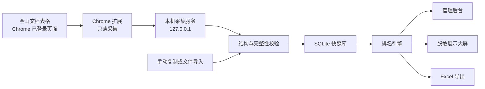

# 信息素养大赛成绩核对系统开发文档

> 状态：实施中；自动采集未通过真实验证，当前交付分支为手动导入正式版
>
> 日期：2026-07-19
>
> 运行环境：当前这台 macOS 比赛管理电脑 + Google Chrome
>
> 唯一外部数据入口：[金山文档表格视图](https://www.kdocs.cn/wo/sl/v130lGtJ)

## 1. 项目目标

在不改变裁判填写金山文档的前提下，在比赛管理电脑本地完成：

- 自动采集通过真实技术门时提供定时同步和管理员立即同步；未通过时只提供明确标识的手动导入。
- 按“赛区＋赛项＋组别”分别计算排名。
- 可视化展示赛事状态、异常成绩和排名。
- 提供管理后台与脱敏展示大屏两套视图。
- 按分组、赛项或全部赛项导出 Excel。
- 在采集失败、登录过期或表格结构变化时保留最近一次成功结果，不发布半成品数据。

系统的核心价值不是替代裁判表格，而是把裁判表格转换成可核对、可追溯、可展示、可导出的本地成绩快照。

## 2. 已确认约束

1. 当前只能提供金山文档分享链接，不假设能够获得金山开放平台 `APPID`、`APPKEY`、OAuth 授权或文档所有者配合。
2. 比赛管理电脑就是当前这台 Mac。
3. 允许安装 Chrome 扩展和小型本地采集程序。
4. 比赛时由管理员本人登录金山文档，并保持目标表格页面在 Chrome 中打开。
5. Chrome 扩展和本地程序只能读取目标文档，不得修改、排序、筛选或回写裁判表格。
6. 原始数据、登录态、同步快照和导出文件默认只保存在本机，不上传第三方服务。
7. 页面实查时约有 501 条记录；该数字仅用于首轮验证，不能硬编码为业务上限。
8. 自动同步是有条件能力：必须先证明能够稳定读取完整结构化记录；验证失败时降级为手动复制或文件导入。

## 3. 范围与非目标

### 3.1 本期范围

- Chrome 登录态采集。
- 本机同步服务与 SQLite 数据库。
- 字段映射、成绩校验和排名计算。
- 管理后台、展示大屏和 Excel 导出。
- 历史快照、失败保护、隐私隔离和本机运行说明。

### 3.2 本期非目标

- 不开发裁判评分录入系统。
- 不修改金山文档内容或分享权限。
- 不依赖金山开放平台 API。
- 不把身份证号、手机号或完整原始表格发送到云端。
- 不默认开放局域网或公网访问。
- 不以截图 OCR、像素识别或逐屏滚动拼接作为正式数据采集方案。

## 4. 总体架构



### 4.1 组件职责

| 组件 | 职责 | 明确不负责 |
|---|---|---|
| Chrome 扩展 | 识别目标页面、读取结构化记录、上报连接状态 | 不保存账号密码，不修改金山文档 |
| 本机采集服务 | 接收采集结果、调度同步、校验、持久化、提供本地 API | 不绕过登录，不向外部服务器转发原始数据 |
| 排名引擎 | 校验成绩、按分区排名、生成异常原因 | 不猜测赛项分数范围，不修正裁判成绩 |
| 管理后台 | 同步、配置、核对、快照、导出 | 不直接操作金山文档 |
| 展示大屏 | 显示脱敏排名、更新时间和过期警告 | 不显示敏感字段，不提供编辑或导出 |

## 5. 推荐技术栈与目标目录

### 5.1 技术栈

- 语言：TypeScript，开启严格模式。
- Chrome 扩展：Manifest V3。
- 本机服务：Node.js + Fastify。
- 管理后台与大屏：React + Vite，自定义 CSS 变量和组件，不引入重型通用 UI 套件。
- 数据库：SQLite；敏感列单独加密，密钥存入 macOS Keychain。
- 数据校验：Zod 或等价的运行时 Schema 校验。
- 精确小数：`decimal.js` 或等价十进制定点实现，禁止直接用二进制浮点比较成绩。
- Excel：ExcelJS。
- 测试：Vitest + Playwright。
- 包管理与任务入口：pnpm workspace。

### 5.2 目标目录

```text
.
├── AGENTS.md
├── 开发文档.md
├── apps/
│   ├── extension/          # Chrome Manifest V3 扩展
│   ├── server/             # 本机采集、校验、快照和导出服务
│   └── web/                # 管理后台与展示大屏
├── packages/
│   ├── domain/             # 字段模型、排名规则、异常码
│   ├── ranking/            # 纯排名引擎
│   ├── storage/            # SQLite 与敏感字段加密
│   └── ui/                 # iOS 风格设计令牌与共享组件
├── tests/
│   ├── fixtures/           # 仅允许虚构或脱敏测试数据
│   └── e2e/
└── data/                   # 运行时本地数据，必须被 Git 忽略
```

## 6. 采集策略与首要技术验证

金山文档表格主体由 Canvas 和内部数据模型渲染，不能把 DOM 文本或截图当成完整数据源。实施必须先完成采集探针，按以下优先级尝试：

1. 读取页面运行时暴露的结构化数据模型或正式文档交互对象。
2. 在页面自身上下文内观察已授权的结构化请求和响应，并从中得到字段与记录。
3. 使用金山页面自带的复制能力取得完整结构化表格，再交给本机导入器。
4. 若以上方法均不能稳定覆盖全部记录，正式模式只保留手动复制或文件导入。

不得把截图 OCR、视觉识别、逐屏截图拼接或读取当前可见 Canvas 像素作为正式方案。

### 6.1 自动采集通过标准

只有同时满足以下条件，后台才允许显示“自动同步可用”：

- 连续 3 次重新加载页面，均能得到相同字段集合和完整记录数。
- 采集记录数与金山页面显示的总记录数一致。
- 必需字段“赛区、赛项、组别、选手姓名、成绩”全部可映射。
- 能识别记录的稳定标识，或用稳定组合键和内容哈希可靠去重。
- 裁判修改一条成绩后，系统能在一个同步周期内识别变化。
- 水平滚动、垂直滚动和当前可见区域不影响采集完整性。
- 采集过程不触发任何写入、编辑、排序或筛选操作。
- 敏感值不出现在浏览器扩展日志、本机服务日志和测试报告中。

任一标准未通过，自动采集状态必须为“验证未通过”，不得伪装为实时同步。

## 7. 字段映射与数据模型

### 7.1 规范字段

| 规范字段 | 用途 | 必需 |
|---|---|---|
| `region` | 赛区 | 是 |
| `event` | 赛项 | 是 |
| `group` | 组别 | 是 |
| `participantName` | 管理核对与脱敏展示 | 是 |
| `scoreRaw` | 原始成绩文本 | 是 |
| `sourceRecordId` | 去重与变更追踪 | 是；无原生 ID 时生成稳定替代键 |
| `phone` | 管理核对 | 否；加密保存 |
| `idNumber` | 管理核对 | 否；加密保存 |
| `sourceFields` | 其他允许保留的本地字段 | 否；遵守最小化原则 |

字段映射由管理员在首次运行时确认。字段被改名或删除后，本次同步失败并提示重新映射，不能静默映射到相似字段。

### 7.2 核心实体

- `SourceRecord`：一次成功快照中的规范化参赛记录。
- `EventRule`：按赛项配置的最低分、最高分、两位小数精度规则与启用状态；同名赛项在不同赛区沿用同一规则。
- `SyncRun`：一次自动、立即或手动导入发布尝试及其状态、来源、记录数、错误码和时间；成功时间独立于快照创建时间持久化。
- `Snapshot`：通过完整性校验的不可变版本，包含字段版本、内容哈希和发布状态。
- `RankingRow`：由快照和规则计算出的名次、成绩、有效性及异常原因。

## 8. 成绩校验与排名规则

### 8.1 分区

排名分区键固定为：

```text
赛区 × 赛项 × 组别
```

任何一个维度不同都不得混排。

### 8.2 成绩合法性

- 每个赛项必须单独配置最低分和最高分；系统不提供 `0–100` 默认值。
- 成绩最多允许两位小数。
- 空值、非数字、超范围或超过两位小数的记录不参与排名。
- 未配置成绩范围的赛项标记为“待配置”，整个赛项暂不生成排名。
- 系统只报告异常，不自动修改裁判成绩。

### 8.3 排名算法

- 分数按十进制精确值从高到低排序。
- 使用标准竞赛排名：同分同名次，下一名跳号，例如 `1、2、2、4`。
- 同分记录的展示顺序保持来源记录顺序稳定，但其名次完全相同。
- 计算公式：当前记录名次等于当前分区中第一条同分记录的排序位置加一。

## 9. 同步、校验与原子发布

### 9.1 同步入口

- 自动采集通过真实技术门时，自动同步默认每 60 秒一次，后台允许调整。
- 自动采集通过真实技术门时，管理员可触发立即同步；立即同步与自动同步共用同一队列和校验流程。
- 手动导入：复制粘贴或文件导入，进入相同字段映射、校验、快照和排名流程。

手动正式版不显示或调用自动同步、立即同步入口。每次手动发布仍必须记录 `SyncRun`，相同内容不重复创建快照，但本次成功校验时间必须更新并在重启后保留。

同一时刻只允许一个同步任务运行。新的触发请求在当前任务结束后合并执行，不并发覆盖。

### 9.2 发布规则

每次同步必须读取完整数据，并依次通过：

1. 页面与登录状态检查。
2. 字段 Schema 检查。
3. 总记录数与重复记录检查。
4. 规范化与敏感字段处理。
5. 赛项规则和成绩合法性检查。
6. 排名计算。
7. SQLite 单事务写入。
8. 原子切换当前已发布快照。

任何一步失败，本次快照均不得成为当前结果。大屏继续显示最近一次成功快照。

### 9.3 状态与新鲜度

- `已连接`：扩展检测到目标文档并可读取。
- `同步中`：正在生成候选快照。
- `已同步`：新快照已原子发布。
- `需要登录`：金山登录失效。
- `页面已关闭`：目标标签页不存在。
- `字段变化`：必需字段缺失或映射失效。
- `同步失败`：采集、校验、存储或排名失败。

默认 120 秒未成功同步即标记“数据可能已过期”；超过 5 分钟标记为红色严重警告。阈值可在本机设置中调整，且严重警告阈值必须大于过期阈值。

### 9.4 快照保留

- 只有内容哈希发生变化才创建新快照。
- 快照记录时间、来源、记录数、有效数、异常数、字段版本和内容哈希。
- 默认保留最近 30 天内发生数据变化的快照；当前快照永不因保留策略被删除。
- 管理员可以查看快照内容、与当前快照比较或恢复上一成功快照；恢复行为本身生成新的审计记录。

## 10. 管理后台与展示大屏

### 10.1 管理后台页面

- 赛事指挥台：同步状态、记录总数、有效成绩、异常数量、最新排名。
- 成绩排名：按赛区、赛项、组别筛选，支持姓名搜索。
- 异常记录：按异常原因聚合，并显示来源记录定位信息。
- 赛项配置：设置最低分、最高分和启用状态。
- 同步管理：手动正式版显示手动发布记录、新鲜度设置和失败详情；自动采集真实 `GO` 后才增加自动同步与立即同步。
- 历史快照：比较、查看和恢复成功版本。
- 导出中心：分组、分赛项和批量导出。

### 10.2 展示大屏

- 只显示赛区、赛项、组别、脱敏姓名、成绩、名次和最后更新时间。
- 支持手动切换及自动轮播不同赛区、赛项和组别。
- 同步过期时显示警告，但保留最近一次成功排名。
- 不提供编辑、导出、搜索或查看原始记录的入口。
- 姓名默认保留首尾字符或按长度生成等价掩码；规则在全场保持一致。

## 11. iOS 风格视觉系统

### 11.1 设计命题

- 具体主体：信息素养大赛现场成绩指挥台。
- 核心受众：比赛管理员、成绩核对人员和观看大屏的现场人员。
- 页面单一首要任务：让管理员一眼确认“数据是否新鲜、排名是否可信、哪里需要处理”。

界面不是通用数据后台，也不是仿制 iPhone 设置页；它必须把“实时成绩可信度”放在视觉中心。

### 11.2 色彩令牌

| 令牌 | 色值 | 用途 |
|---|---|---|
| `frost` | `#F5F7FA` | 后台浅色基底与磨砂层 |
| `ink` | `#101114` | 主文字和高对比数据 |
| `system-blue` | `#0A84FF` | 深色背景、图形和大面积品牌强调 |
| `action-blue` | `#0066CC` | 浅色背景上的按钮、小字号链接和键盘焦点，保证 WCAG AA |
| `system-green` | `#30D158` | 已连接、已同步、有效状态 |
| `system-orange` | `#FF9F0A` | 待处理、临近过期、并列提示 |
| `system-red` | `#FF453A` | 同步失败、严重过期、无效成绩 |

深色大屏基于 `ink` 派生深蓝黑背景，避免另建一套无关联品牌色。

### 11.3 字体角色

- 展示标题：`SF Pro Display` / `PingFang SC` / macOS 系统无衬线，使用紧凑字距和明确重量。
- 正文与控件：`SF Pro Text` / `PingFang SC` / macOS 系统无衬线。
- 成绩、名次和时间：`SF Mono` / 等宽回退字体，使用表格数字特性，保证纵向对齐。

### 11.4 布局

```text
┌──────────────┬──────────────────────────────────────────┐
│ 浮动侧边栏   │ 赛事名称                     同步状态 按钮 │
│              │ 大标题：赛事指挥台                       │
│ 总览         │ [参赛记录] [已出成绩] [异常] [完成赛项]  │
│ 排名         │ ┌────────────────────┬─────────────────┐ │
│ 异常         │ │ 最新排名           │ 需要处理        │ │
│ 配置         │ └────────────────────┴─────────────────┘ │
│ 导出/快照    │                                          │
└──────────────┴──────────────────────────────────────────┘

展示大屏：深色高对比标题 + 数据新鲜度 + 大字号排名表
```

### 11.5 赛事专属识别元素

唯一重点视觉风险是“数据新鲜度光环”：成功更新或状态变化时使用一次克制的收束动画，静止后继续用颜色、图标和文字共同表达数据状态。

- 绿色：最近一次成功同步在新鲜阈值内。
- 橙色：数据可能已过期。
- 红色：严重过期或采集断开。
- 点击状态可查看最后成功时间和失败原因。

其余界面保持安静，不叠加无业务意义的渐变、装饰图形或泛滥动画。

### 11.6 自我审查与修订

单纯使用圆角、玻璃和系统蓝会变成任何项目都能套用的通用 iOS 模板。为避免这一点，设计已做以下修订：

- 首屏视觉重心从普通 KPI 卡片转向“数据新鲜度＋异常处理＋最新排名”的赛事闭环。
- 分段筛选严格对应赛区、赛项和组别，不使用无含义装饰导航。
- 名次、并列和快照状态采用赛事语义，而不是通用业务术语。
- 深色模式只用于展示大屏，形成“后台核对、现场公示”的明确角色差异。

### 11.7 动效与可访问性

- 只保留一次有意义的同步完成动画：状态光环收束、数据差异短暂高亮、排名稳定落位。
- 禁止持续跳动的卡片和无目的悬浮动画。
- 遵守 `prefers-reduced-motion`，关闭呼吸与位移动效。
- 所有操作支持键盘焦点；文字与背景满足 WCAG AA 对比度。
- 状态不能只依靠颜色，必须同时显示文字和图标。
- 移动窄屏降为单列核对模式；大屏重点适配 16:9 投影。

### 11.8 界面用语

- 使用“立即同步”“保存赛项规则”“导出当前分组”等可预测动作名称。
- 错误必须说明原因和下一步，例如“金山文档页面已关闭，请重新打开目标链接”。
- 不使用“提交”“发生未知错误”“请稍后重试”等缺乏具体动作的信息。

## 12. Excel 导出

### 12.1 导出模式

- 当前分组：导出一个“赛区＋赛项＋组别”的排名表。
- 当前赛项：导出一个 Excel 文件，每个“赛区＋组别”生成独立工作表。
- 全部赛项：批量生成多个赛项文件并打包。

### 12.2 默认字段

- 名次
- 赛区
- 赛项
- 组别
- 选手姓名
- 成绩
- 状态

手机号和身份证号默认不导出。管理员主动选择敏感字段时必须二次确认，导出文件名和审计记录标记“含敏感信息”。

### 12.3 可追溯信息

每个导出文件必须包含：

- 生成时间。
- 数据快照 ID 与快照时间。
- 排名分区和同分规则。
- 有效记录数与异常记录数。
- 数据来源类型：自动同步、立即同步或手动导入。

推荐文件名：

```text
信息素养大赛_赛区_赛项_组别_成绩排名_YYYYMMDD-HHmm.xlsx
```

## 13. 隐私与安全

- 服务默认只监听 `127.0.0.1`，不得默认监听 `0.0.0.0`。
- Chrome 扩展只申请目标金山文档域名和本机服务所需最小权限。
- 扩展不得读取、导出或持久化金山账号密码、Cookie 和无关标签页内容。
- 扩展与本机服务使用安装时生成的随机配对令牌，拒绝其他网页向本机接口写入数据。
- 手机号和身份证号在 SQLite 中按列加密，密钥存入 macOS Keychain。
- 日志、测试夹具、截图、错误报告和 Git 历史不得包含真实敏感数据。
- 展示大屏 API 从排名结果生成独立脱敏 DTO，不得把完整记录下发后再由前端隐藏。
- 本地 `data/`、导出目录、浏览器调试文件和快照数据库必须加入 `.gitignore`。
- 如未来需要局域网或公网访问，必须单独设计身份认证、TLS、访问审计与数据最小化，不沿用本机默认配置直接开放。

## 14. 失败处理

| 场景 | 系统行为 | 管理员提示 |
|---|---|---|
| 金山未登录 | 停止新同步，保留上次快照 | “金山登录已失效，请在目标标签页重新登录” |
| 页面关闭 | 停止新同步 | “金山文档页面已关闭，请重新打开目标链接” |
| 记录读取不全 | 丢弃候选快照 | “本次只读取到部分记录，未更新排名” |
| 字段被改名或删除 | 丢弃候选快照 | “字段结构已变化，请重新确认字段映射” |
| 赛项未配置范围 | 该赛项不排名 | “该赛项尚未设置最低分和最高分” |
| 成绩不合法 | 记录进入异常列表 | 显示具体原因，不修改原值 |
| SQLite 写入失败 | 回滚事务 | “本次数据未发布，仍显示上一成功版本” |
| Excel 生成失败 | 不产生残缺文件 | 显示失败赛项和可重试动作 |

## 15. 测试策略

### 15.1 单元测试

- 按“赛区＋赛项＋组别”正确分区。
- 标准竞赛排名 `1、2、2、4`。
- 整数、一位小数和两位小数。
- 空值、非数字、越界和三位以上小数。
- 未配置赛项规则。
- 同分记录的稳定展示顺序。
- 姓名脱敏和敏感字段 DTO 隔离。

### 15.2 集成测试

- 扩展与本机服务配对和权限拒绝。
- 完整记录数校验与部分数据拒绝。
- 自动同步和立即同步互斥。
- 快照内容哈希去重。
- SQLite 事务失败后保持上一已发布快照。
- 手动导入与自动采集产生一致排名。
- Excel 工作表拆分、字段顺序、元数据和文件名。

### 15.3 端到端测试

- 首次打开、字段映射、赛项配置、同步、核对、导出全流程。
- 金山登录过期、页面关闭和重新连接。
- 裁判修改成绩后一个同步周期内更新。
- 大屏只获得脱敏字段。
- 大屏过期状态与最近成功快照保留。
- 16:9 全屏、Mac 常用分辨率和窄屏管理视图。

### 15.4 性能与可靠性验收

- 当前约 501 条记录的本地校验、排名和快照提交应在 1 秒内完成。
- 在 5,000 条合成记录下，排名与导出不得出现明显界面阻塞。
- 自动同步连续运行 4 小时，无重复快照、内存持续增长或状态漂移。
- 连续 3 次采集结果不一致时，系统自动禁用发布并要求人工检查。
- 正式 4 小时测试必须在当前 Mac 上保持系统唤醒，并把超过两倍采样周期的空档判为测试中断；睡眠/唤醒造成的缺失采样不得计为连续运行通过。
- 内存验收以启动预热后的稳定窗口比较判断持续增长，同时记录完整峰谷范围；不得把 Chrome 启动峰值随后回落误报为内存增长。

## 16. 实施阶段

### 阶段 0：采集可行性探针

- 搭建最小 Chrome 扩展和本机接收端。
- 验证完整字段、完整记录、稳定标识和变更检测。
- 输出明确结论：自动采集通过，或仅保留手动导入。

### 阶段 1：领域模型与排名内核

- 建立规范字段、赛项规则、异常码和排名纯函数。
- 完成单元测试和合成数据验证。

### 阶段 2：同步、快照与隐私存储

- 实现同步状态机、SQLite 事务、内容哈希、快照和 Keychain 密钥。
- 实现失败保护和历史版本。

### 阶段 3：iOS 风格管理后台与大屏

- 实现赛事指挥台、排名、异常、赛项配置、快照和大屏。
- 落实设计令牌、数据新鲜度光环、键盘焦点和减少动效。

### 阶段 4：Excel 导出与现场加固

- 实现三种导出模式、敏感字段二次确认和可追溯元数据。
- 完成 4 小时稳定性测试和现场运行说明。

## 17. 验收标准

项目只有同时满足以下条件才可称为完成：

1. 自动采集通过第 6.1 节全部标准，或系统明确降级并只显示手动导入能力。
2. 所有有效记录按确认规则排名，所有无效记录有明确异常原因。
3. 若自动采集通过，自动同步和立即同步共用同一校验、快照和原子发布流程；若采用手动正式版，两者均不得显示或调用。
4. 页面或登录失败不会覆盖最近成功排名。
5. 展示大屏不下发手机号、身份证号等敏感字段。
6. 分组、分赛项和批量 Excel 导出均通过结构校验。
7. iOS 风格界面与已确认视觉方向一致，并通过键盘、对比度和减少动效检查。
8. 单元、集成、端到端和 4 小时稳定性测试通过。
9. 当前 Mac 上有可重复执行的安装、启动、登录、同步、展示和退出流程。

## 18. 现场运行流程

1. 启动本机成绩系统。
2. 打开 Chrome，并登录能够访问目标表格的金山账号。
3. 打开目标金山文档链接并保持标签页存在。
4. 自动采集已通过时确认扩展显示“已连接”；手动正式版确认后台明确显示“自动采集未验证”。
5. 在管理后台确认字段映射、赛项分数范围和记录总数。
6. 自动采集已通过时点击“立即同步”；手动正式版从金山表格复制或导出后完成预览与发布，再核对有效数、异常数和排名分区。
7. 打开展示大屏全屏模式。
8. 比赛期间观察数据新鲜度光环和最后同步时间。
9. 需要发布文件时，从导出中心选择当前分组、当前赛项或全部赛项。
10. 比赛结束后退出本机服务，并按赛事数据管理要求保留或清理本地快照与导出文件。

## 19. 主要风险与应对

| 风险 | 影响 | 应对 |
|---|---|---|
| 金山网页内部结构更新 | 自动采集失效 | 采集探针、字段版本、失败即停发、手动导入兜底 |
| 分享权限或账号状态变化 | 无法读取 | 明确登录与连接状态，保留最近成功快照 |
| Canvas 只加载可见区域 | 数据不完整 | 禁止发布部分数据，必须与总记录数一致 |
| 敏感数据泄露 | 严重隐私风险 | 本机绑定、列加密、日志脱敏、独立大屏 DTO |
| 赛项规则配置错误 | 排名错误 | 无默认范围、保存前校验、规则变更后重算并记录快照 |
| 现场误把旧排名当最新 | 发布错误 | 新鲜度光环、最后同步时间、过期警告和原子发布 |
